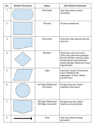
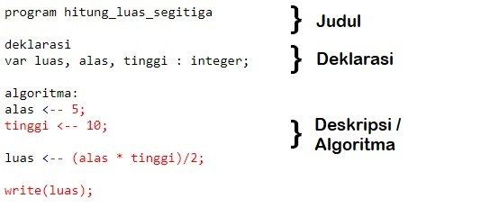
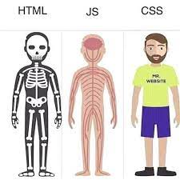
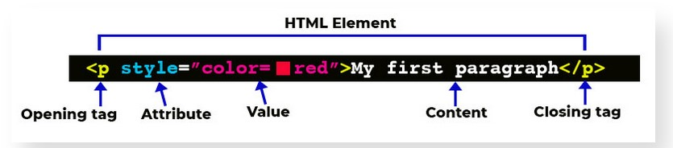
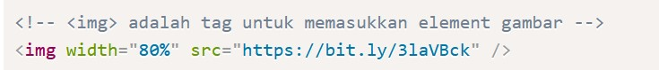
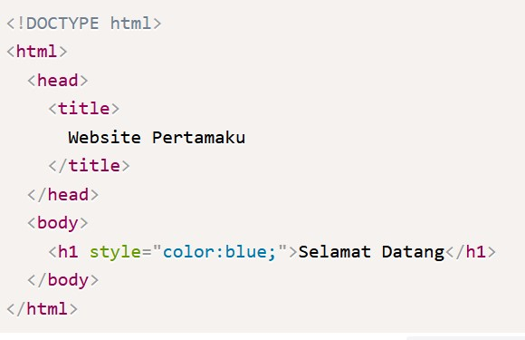
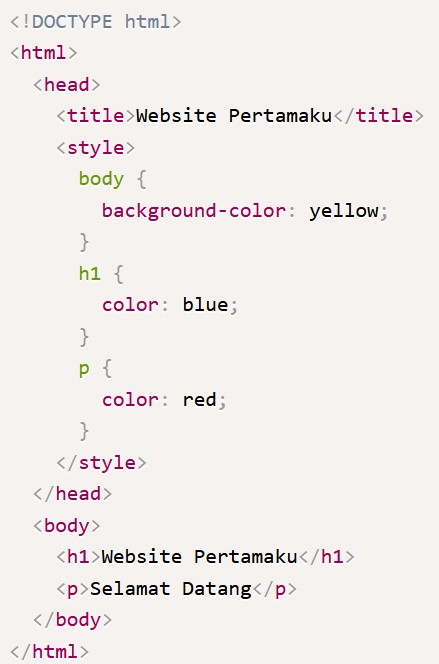
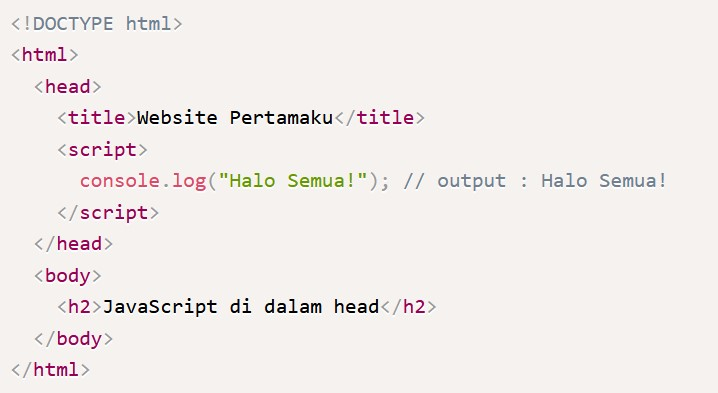

## Algoritma
Algoritma adalah metode atau langkah yang direncanakan secara tersusun dan berurutan untuk menyelesaikan atau memecahkan permasalahan dengan sebuah intruksi atau kegiatan.

Ada 4 jenis Algoritma, yaitu:
- **Sequence**, adalah Intruksi yang dijalankan secara berurutan. contoh Gelas diisi dengan air, lalu air siap untuk diminum
- **Selection**, adalah Intruksi yang dijalankan jika memenuhi suatu kondisi. contoh : Gelas diisi dengan air, lalu air siap untuk diminum
- **Iteration**, adalah Intruksi yang berulang kali dijalankan selama memenuhi suatu kondisi. Contoh : Selama belum sampai rumah, saya akan terus menyetir
- **Concurrent**, Intruksi yang dijalankan secara bersamaan. contoh : Selama belum sampai rumah, saya akan terus menyetir

Ada 3 cara penyajian algortima, yaitu:
- **Deskriptif**, yaitu Menulis dengan bahasa sehari-hari
- **Flowchart**, yaitu Menulis dengan bahasa sehari-hari.

- **Pseucode**, yaitu Penulisan algoritma yang hampir menyerupai penulisan pada kode pemrograman. Pada umunya pseucode memiliki 3 bagian, yaitu judul, deklarasi(mendefinisikan/menyiapkan semua nama (variabel) yang akan digunakan), deskripsi (langkah-langkah penyelesaian).

## HTML
Hypertext Markup Language (HTML) adalah bahasa markah standar untuk dokumen yang dirancang untuk ditampilkan di peramban internet.
Dalam membuat website, HTML dapat dianalogikan seperti tulang yang membangun tubuh kita, sedangkan css untuk mempercantik tubuh kita.

Adapaun tools yang digunakan dalam mempelajari HTML yaitu 
- **IDE** contohnya VSCO
- **browser** untuk melihat hasil codingan

HTML Tag, Element, Attributr & Comment
- **Tag**, ada 2 tipe tag HTML, yaitu opening dan closing. Pada HTML memiliki 3 tag utama, yaitu <html>, <head>, dan <body>.
- **Element**, HTML Element merupakan sebuah komponen dalam halaman web, bisa berupa paragraf, judul, atau gambar. Ada 2 jenis HTML element, yaitu HTML Element (memiliki opening dan closing tag) dan Empty HTML (hanya memiliki Opening Tag)

- **Attribute**, Di dalam Opening Tag dapat berisi attribute, yang berfungsi untuk memberikan informasi tambahan kepada sebuah element.
contoh :

- **comment**, comment adalah catatan kecil yang bisa kita tambahkan ke dalam kode sumber (source code) tanpa mengubah fungsi dari program yang kita buat.

## CSS
CSS adalah bahasa komputer yang digunakan untuk menambahkan design ke suatu halaman website di internet.

CSS adalah singkatan dari Cascading Style Sheets.
CSS bagaikan kulit pada tubuh kita, yang membungkus tulang agar tidak menyeramkan dan nyaman dilihat. 

Ada 3 cara menyisipkan CSS =, yaitu :
- **inline**,  yaitu menggunakan attribute style untuk menyisipkan kode CSS langsung di dalam HTML element.
contoh: 

- **internal**, yaitu menggunakan element style untuk menyisipkan kode CSS. Element  tersebut diletakkan di dalam element .
contoh:

- **eksternal**, yaitu sebuah file CSS terpisah yang disambungkan dengan file HTML dengan menggunakan element <link>.
contoh:

CSS Syntax adalah syntax yang digunakan untuk menunjuk atau memilih HTML element mana yang ingin diberi style (dihias). CSS syntax terdiri dari selector, property, dan value.

Ada 4 mode layout dalam css, yaitu:
- Block
- Inline
- Table
- Positioned

## Intro to Javascript
JavaScript adalah bahasa pemrograman yang digunakan dalam pengembangan website agar lebih dinamis dan interaktif. Kalau sebelumnya kamu hanya mengenal HTML dan CSS, nah sekarang kamu jadi tahu bahwa JavaScript dapat meningkatkan fungsionalitas pada halaman web. Bahkan dengan JavaScript ini kamu bisa membuat aplikasi, tools, atau bahkan game pada web.
ada 2 cara menyisipkan javascript, yaitu :
- **internal**, yaitu menyisipkan kode JavaScript langsung di dalam file HTML. Untuk menyisipkan kode JavaScript di dalam file HTML, kita bisa menuliskan kode JavaScript di dalam tag script. Tag script sendiri bisa ditulis di dalam head maupun di dalam bagian akhir dari body.
contoh penggunaan :

- **eksternal**, yaitu membuat file JavaScript sendiri dan menyambungkannya dengan file HTML.Cara menyambungkannya sama seperti internal JavaScript, yaitu menggunakan tag script di dalam element body, hanya saja, kita menambahkan attribute src di dalam script untuk menyambungkan dengan file eksternal JavaScript kita.

ada 7 tipe data Javascript, yaitu :
- **string**, deretan karakter yang diapit oleh sepasang tanda kutip;
- **number**, bilangan bulat, pecahan, dan lain-lain;
- **boolean**, nilai benar dari sebuah pernyataan yang dituliskan sebagai true atau false;
- **null**, sebuah nilai yang berarti kosong atau menunjuk pada nilai yang tidak ada;
- **undefined**, berbeda dari null, undefined menandakan kondisi variabel yang belum diberi sebuah nilai. Jadi pernyataan "nilai variabel itu adalah undefined" sebenarnya kurang tepat, sebab variabelnya memang tidak mempunyai sebuah nilai;
- **symbol**, sebuah nilai unik yang dihasilkan tiap kali kita memanggil fungsi Symbol(). Nilai unik ini memiliki beberapa kegunaan seperti memberi nomor identifikasi unik dan berperan sebagai nama properti unik sebuah objek;
- **object**, sebuah kumpulan pasangan properti dan nilai. Seperti objek dalam kehidupan sehari-hari saja. Misalnya objek Apel memiliki properti warna dengan nilai merah.

